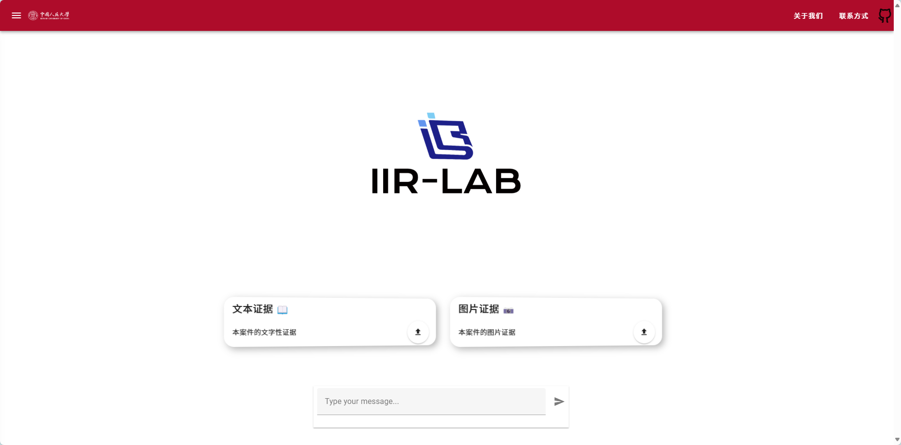
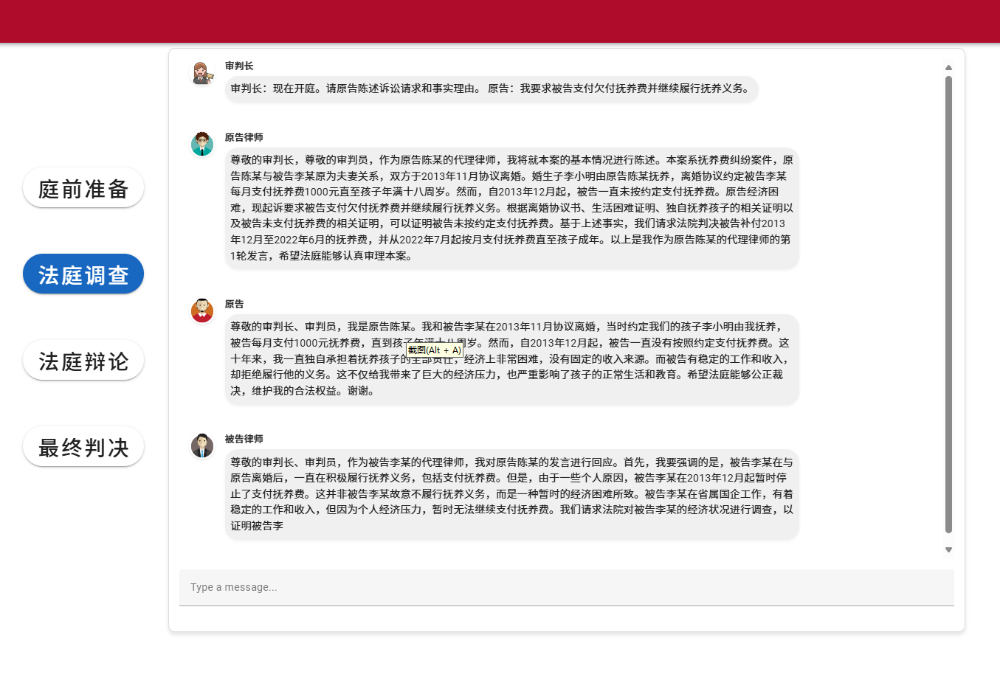
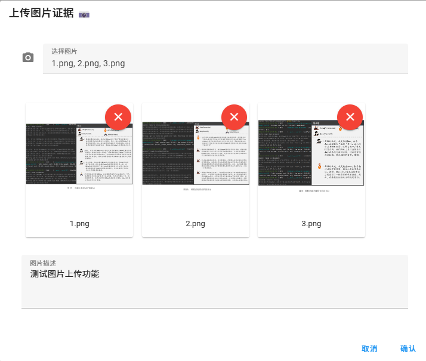
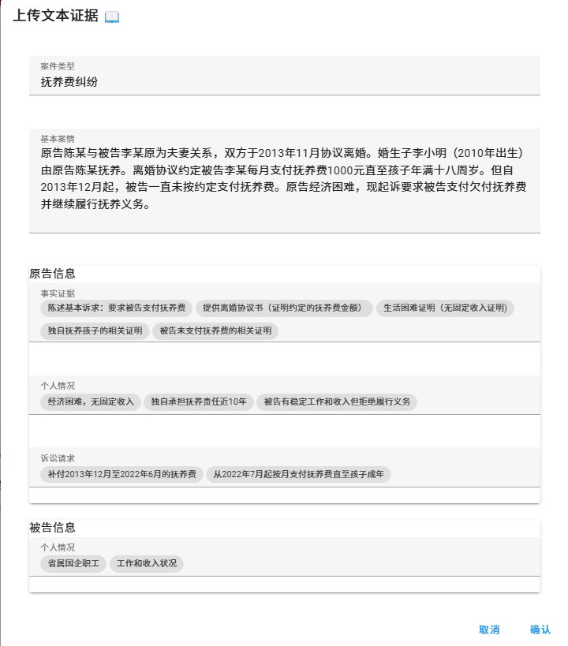

# 🔍 Law GPT - 智能法律助手

> 让法律不再枯燥，法庭辩论更智能！💯

一款基于Vue和Flask打造的智能法律咨询系统，为法学院学生、法律工作者和普通公民提供模拟法庭环境和法律咨询服务。实时互动、案例分析、智能角色扮演，让你在轻松的环境中体验真实的法庭对决！

## ✨ 超酷功能

* **实时法庭模拟** - 体验审判长、律师、原告和被告的角色互动
* **智能对话** - 实时生成符合法律专业的对话内容
* **证据上传** - 支持文本和图片证据的管理
* **庭审流程** - 完整模拟包括庭前准备、法庭调查、辩论和判决的全过程
* **实时反馈** - 观点总结员帮你理清案件关键点

## 🛠️ 技术栈

### 💻 前端

* **Vue 3** - 响应式UI框架
* **Vuetify 3** - 美观的Material Design组件
* **WebSocket** - 实时通信技术
* **Axios** - 优雅的HTTP请求

### ⚙️ 后端

* **Flask** - 轻量级Python后端
* **WebSocket Server** - 实时消息推送
* **文件处理系统** - 处理图片和文本证据

## 🚀 快速开始

### 克隆项目

```bash
git clone https://github.com/yourusername/law-gpt.git
cd law-gpt
```

### 前端环境

```bash
# 安装依赖
npm install
# 或使用yarn
yarn install

# 启动开发服务器
npm run serve
# 或使用yarn
yarn serve
```

### 后端环境

```bash
# 安装依赖
pip install flask flask-cors ws

# 启动WebSocket服务器
node server.js

# 启动Flask后端
python app.py
```

## 📱 界面预览








## 💡 使用场景

* **法学院学生** - 模拟法庭实践，提升实战能力
* **律师培训** - 快速熟悉不同类型案件的庭审流程
* **普法教育** - 让公众了解法庭程序和法律知识
* **法律咨询** - 提供初步的法律分析和建议

## 🔧 开发笔记

* 前端开发端口: `8080`
* 后端API端口: `5000`
* WebSocket端口: `3000`

### API接口

* **POST** `/api/saveCaseData` - 保存案件文本数据
* **POST** `/api/uploadImages` - 上传案件相关图片

## 🤝 贡献指南

1. Fork本项目
2. 创建你的特性分支 (`git checkout -b feature/AmazingFeature`)
3. 提交你的更改 (`git commit -m 'Add some AmazingFeature'`)
4. 推送到分支 (`git push origin feature/AmazingFeature`)
5. 开一个Pull Request

## 📝 注意事项

* 建议使用Node.js 14+和Python 3.7+
* 运行前确保相关端口未被占用
* 首次使用需要完成证据上传才能开始模拟庭审

## 📜 许可证

MIT License © 2024 Your Name

---

**有问题？有建议？** [提交Issue](https://github.com/yourusername/law-gpt/issues) 或发送邮件到 your.email@example.com
